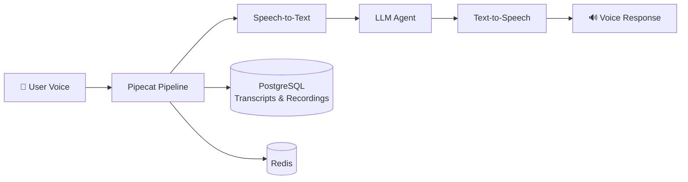

 

  

---

## 👋 About Me

I'm a **Computer Science Engineering student (B.Tech, 2023–2027)** who enjoys building backend systems, full-stack apps, and AI-powered products. My core focus right now is **Java and Spring Boot**, and I'm actively exploring system design, microservices, and LLM applications.

| | |
|---|---|
| 🎯 **Primary Focus** | Java · Spring Boot · REST APIs · Backend Development |
| 🌱 **Currently Learning** | System Design · Microservices · AI / LLM Applications |
| ⚡ **Interests** | Scalable Systems · Real-time Apps · Backend Architecture · DSA |
| 📫 **Reach Me** | [shivam290204tiwari@gmail.com](mailto:shivam290204tiwari@gmail.com) |
| 🤝 **Status** | Open to internships and collaborations |

---

## 🛠️ Tech Stack

<table>
<tr><td><b>Languages</b></td><td>

</td></tr>
<tr><td><b>Backend</b></td><td>

</td></tr>
<tr><td><b>Frontend</b></td><td>

</td></tr>
<tr><td><b>Databases</b></td><td>

</td></tr>
<tr><td><b>Tools & DevOps</b></td><td>

</td></tr>
<tr><td><b>AI / ML</b></td><td>

</td></tr>
</table>

---

## 🚀 Featured Projects

### 🎙️ Dracarys Voice AI Platform
> A conversational AI platform for real-time voice and chat interactions, with an agent builder, live transcripts, and call recordings.

`Python` `FastAPI` `Next.js` `React` `PostgreSQL` `Redis` `Pipecat` `Docker`

- Real-time voice pipelines integrating STT, LLM, and TTS
- FastAPI backend services with live transcripts and call recordings
- AI agent builder with a Next.js / React frontend
- Docker-based deployment

 

### 🛒 QuickShopping
> An AI-powered shopping platform that compares and ranks products using multiple factors, and explains why.

`Next.js` `TypeScript` `Node.js` `Fastify` `PostgreSQL` `Redis` `Gemini API`

- AI-powered product ranking with **explainable recommendations**
- Review quality analysis and ranking-factor explanations
- Redis caching and parallel product processing for fast responses
- Side-by-side product comparison

 

### 👥 PeerPod – CodeWithFriend
> A real-time collaborative coding platform for working together in a shared development environment.

`React` `Node.js` `Express.js` `MongoDB` `WebSockets` `Yjs` `JWT`

- Collaborative code editor with **CRDT-based sync (Yjs)** and live multi-user cursors
- Real-time chat, presence, and a collaborative whiteboard
- JWT authentication, room and user management
- Sandboxed code execution

---

## 💼 Experience

**Software Development Intern** · *Vibhum Software Services Pvt. Ltd.* · `Sep 2026 – Present`
- Working on web development and AI-driven solutions, including a real-time conversational AI voice-agent platform
- Also contributing to website analysis, SEO and keyword research, Google Trends, content development, and AI-powered application workflows

**AI Summer Training Intern** · *CSRBOX × IBM SkillsBuild* · `Jul 2025 – Aug 2026`
- Project-based training in Agentic AI and multi-agent workflows, with hands-on exposure to AI-driven application development

---

## 🏆 Achievements

| Achievement | Details |
|---|---|
| 🧩 **DSA** | 400+ problems solved on LeetCode and GeeksforGeeks |
| 🎓 **GATE 2026** | AIR 49,459 — Computer Science |
| 💡 **Hackathons** | Smart India Hackathon participant, multiple national hackathons |
| 📜 **Certification** | IBM SkillsBuild — Agentic AI |

<b>📚 DSA topics I practice</b>

 

`Arrays` `Strings` `Linked Lists` `Stacks & Queues` `Binary Search` `Recursion` `Trees` `Graphs` `Greedy` `Dynamic Programming`

---

## 📊 GitHub Stats

 

  

---

## 📫 Let's Connect

I'm open to internships and collaborations, especially in Java / Spring Boot backend and AI-powered applications.

  

**Code. Learn. Build. Grow.**

